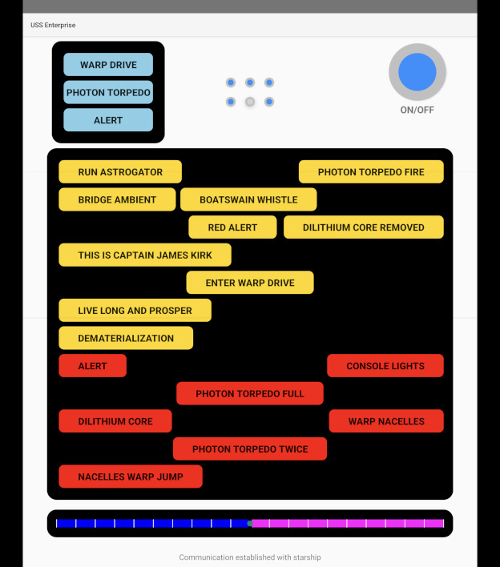

# App for the Playmobil USS Enterprise toy

Playmobil broke their Android app that controls this, so I wrote a replacement.

This communicates via Bluetooth Low Energy.

I reverse engineered the protocol via the phone's developer-mode Bluetooth
snoop logs.

The original app uses Unity, but I implement just the "Command Mode" page
using the stock Android UI widgets.

Everything works, except the volume control for some reason... if someone else
can figure out what I'm doing wrong there, that would be very appreciated.
I've torn my hair out over it.

